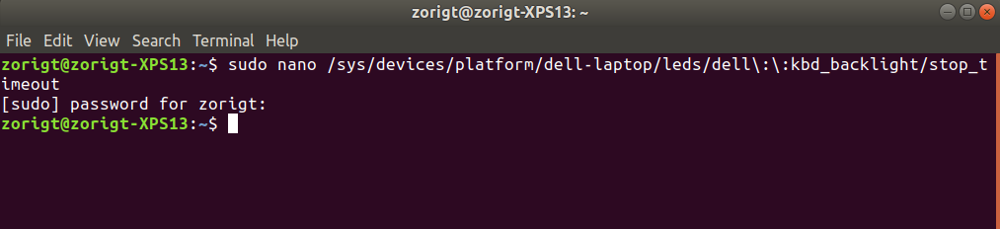

# Dell-XPS-Keyboard-Backlight
```sudo nano /sys/devices/platform/dell-laptop/leds/dell\:\:kbd_backlight/stop_timeout```

Default = "10s" (seconds); Set to something like "20m" (minutes). I like 20 seconds.




